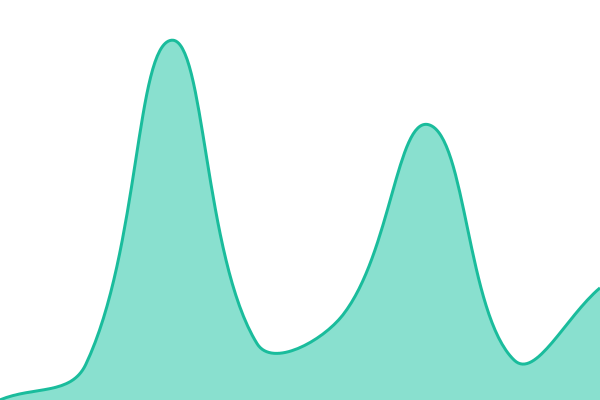

# [📈 Live Status](https://qme-ai-org.github.io/upptime): <!--live status--> **🟩 All systems operational**

This repository contains the open-source uptime monitor and status page for [qme ai ](https://qme-ai-org.github.io/upptime), powered by [Upptime](https://github.com/upptime/upptime).

With [Upptime](https://upptime.js.org), you can get your own unlimited and free uptime monitor and status page, powered entirely by a GitHub repository. We use [Issues](https://github.com/qme-ai-org/upptime/issues) as incident reports, [Actions](https://github.com/qme-ai-org/upptime/actions) as uptime monitors, and [Pages](https://qme-ai-org.github.io/upptime) for the status page.

<!--start: status pages-->
<!-- This summary is generated by Upptime (https://github.com/upptime/upptime) -->
<!-- Do not edit this manually, your changes will be overwritten -->
<!-- prettier-ignore -->
| URL | Status | History | Response Time | Uptime |
| --- | ------ | ------- | ------------- | ------ |
|  [QME AI App](https://app.qme.ai) | 🟩 Up | [qme-ai-app.yml](https://github.com/qme-ai-org/upptime/commits/HEAD/history/qme-ai-app.yml) | 

 1059ms
     
 | 

<a href="https://qme-ai-org.github.io/upptime/history/qme-ai-app">100.00%</a>
    

|  [Core Services](https://app.qme.ai/api/backend-health) | 🟩 Up | [core-services.yml](https://github.com/qme-ai-org/upptime/commits/HEAD/history/core-services.yml) | 

 187ms
     
 | 

<a href="https://qme-ai-org.github.io/upptime/history/core-services">100.00%</a>
    

|  [Background Processing](https://celery-flower-production-199a.up.railway.app) | 🟩 Up | [background-processing.yml](https://github.com/qme-ai-org/upptime/commits/HEAD/history/background-processing.yml) | 

 162ms
     
 | 

<a href="https://qme-ai-org.github.io/upptime/history/background-processing">100.00%</a>
    

|  [AI Tools (MCP)](https://app.qme.ai/.well-known/oauth-protected-resource) | 🟩 Up | [ai-tools-mcp.yml](https://github.com/qme-ai-org/upptime/commits/HEAD/history/ai-tools-mcp.yml) | 

 154ms
     
 | 

<a href="https://qme-ai-org.github.io/upptime/history/ai-tools-mcp">100.00%</a>
    

<!--end: status pages-->

[**Visit our status website →**](https://qme-ai-org.github.io/upptime)

## 📄 License

- Powered by: [Upptime](https://github.com/upptime/upptime)
- Code: [MIT](./LICENSE) © [Anand Chowdhary](https://anandchowdhary.com)
- Data in the `./history` directory: [Open Database License](https://opendatacommons.org/licenses/odbl/1-0/)
